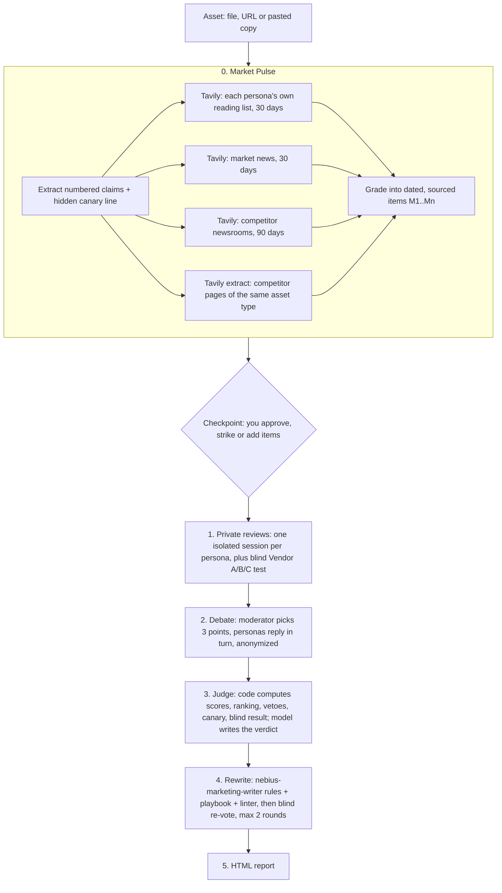

# Nebius Persona Committee

**Skill name: `persona-committee`.** In Claude Code or Codex, invoke it with `/persona-committee` or just ask "run the committee on ...".

A synthetic buying committee for Nebius marketing. Hand it a piece of messaging and it tells you, before the copy ships, how the people who build with, approve and sign for AI infrastructure would react, what they would object to, how the copy compares with competitors, and what to write instead.

It ships as **two skills for Claude Code and Codex**: `persona-committee` (the committee) and `nebius-marketing-writer` (the copywriter it hands rewrites to). One API key (Tavily). No custom GPTs, no servers, no Python packages to install.

> **Internal.** The personas cite internal deal evidence. Reports are for Nebius use only.

---

## Why this exists

Marketing needed a fast, repeatable way to hear buyer objections before a campaign launches. A first version as two custom GPTs (AI Builder, AI Buyer) proved the idea but hit hard limits:

| Limit of a custom GPT | What the committee does instead |
|---|---|
| One model plays one persona per chat. Playing several characters in one context makes them drift and blur | Every persona runs in its **own isolated model session**, in parallel |
| Knowledge files are frozen | A **Market Pulse** checks the live web before every run |
| No comparison with competitors | A **blind side-by-side test** and a claim-by-claim **overlap map** against 309 verbatim competitor excerpts plus live pages |
| Free-text answers, no scoring | Anchored 1 to 7 scores, a ranking, buyer vetoes, honesty checks |
| Advice only | Rewrites by the Nebius marketing writer, **re-voted blind** by the committee |
| Share a link | Install a folder into Claude Code or Codex |

## The committee

Eleven composite personas, each built from 25 to 45 real, linked quotes by people in that role (334 in total), public research and Nebius deal records. The persona files live in the Obsidian vault (`Nebius/Personas/`) and are the source of truth; this repo only reads them.

| Users (vote first) | Buyers (hold a credibility veto) |
|---|---|
| P01 Founder-CTO Farah | P07 CFO Clara |
| P02 Research Founder Randy | P08 CISO Cecil |
| P03 Platform Head Priya | P09 Procurement Head Paula |
| P04 GPU Engineer Gabe | P10 AI Executive Eva |
| P05 Inference Engineer Ingrid | P11 Compute Head Campbell |
| P06 AI Engineer Alan | |

Seating follows the deal motion: a Token Factory asset seats Farah, Priya, Ingrid and Alan; a capacity asset seats Randy, Gabe, Clara and Campbell; an enterprise asset seats Priya, Clara, Cecil, Paula and Eva; a brand asset seats everyone. Pricing and comparison pages add the commercial buyers.

## How it works



### 0a. Nebius fact sweep
Before anyone reviews the copy, the skill checks what Nebius itself has published: the local corpus of nebius.com blog posts and press releases (refreshed daily, newest weighted highest) plus a live Tavily search of nebius.com for the last 30 days. For each message it builds a small pack of verified facts, each a sentence quoted exactly from a dated, linked Nebius source. The personas never see it (they react only to the page, like a buyer). The market check, the conversation planner, the judge and the writer do, so the report never states something false about Nebius, flags where a reviewer assumed wrong, and grounds every rewrite in published proof.

### 0b. Market Pulse: fixed identity, fresh knowledge
The personas' identity (what they are measured on, their veto, their voice) stays fixed in the persona file. What they *know* is refreshed on every run.

- **Claims.** A model breaks the asset into numbered claims, joining stat tiles with their captions ("112% better TCO for inference vs. AWS"). One deliberately weak **canary** line is hidden among them.
- **Where each persona reads.** Every persona has a reading list drawn from its file (Ingrid: Artificial Analysis, OpenRouter, vLLM GitHub, Latent Space; Clara: CFO Dive, WSJ, Mostly Metrics, Deloitte; Cecil: SecurityWeek, Dark Reading, CISO Series). Tavily searches those domains for the last 30 days with a role-specific query.
- **Competitors.** Tavily searches competitor newsrooms over 90 days and extracts the live competitor pages that match the asset type (a pricing page is compared with pricing pages). Each live page is diffed against its Sept 28 library snapshot, so the report can say "CoreWeave's homepage now leads with its Gartner rating."
- **Grading.** A model turns results into short items, each tied to one real result, a source tier (1 primary, 2 trade press, 3 forum sentiment, never fact) and the personas who would notice it. Items that do not trace to a result are dropped in code.
- **Checkpoint.** The brief (`pulse.md`) is shown for approval before any feedback. You can strike items or add your own.

### 1. Private reviews
Each seated persona runs in its own model session with: its agent instructions, its "what keeps me up at night" and real voice quotes, the scoring rubric, its own live items, the copy, the numbered claims, and a **blind comparison**: Nebius's claims and two competitors' verbatim copy, names removed, shuffled into Vendor A, B, C.

Each returns a 1 to 7 score and a one-line reason for **every message** (these fill the grid), scores on five criteria, the stopping objection and the deal stage it bites, whether they would take the meeting, one rewrite, one recommendation, and the blind ranking.

| Criterion | The question |
|---|---|
| Fits their job | Does it speak to the job they are trying to get done? |
| Believable | Would they believe it, and could they check it? |
| Meets the feeling | Does it address what they fear or want to feel? |
| Stands out | Is it different from what competitors say? |
| Clear | Can they tell what is offered, to whom, in one read? |

### 2. The conversation
After private scores are locked, a planner picks three Slack threads: the most disputed message, a live market or competitor moment, and a believability test where a buyer pushes on something users liked. A persona opens each thread by quoting the line; others reply by name, 4 to 6 turns, each its own model call that sees the thread so far. Style rules (`references/conversation-style.md`) keep messages short and human: no speeches, stacked questions, asides, the occasional "tbh". Scores were locked before the thread, so peer pressure cannot change the grid; any change of mind is shown.

### 3. Judge
Numbers are computed in code, never by a model:
- **Ranking:** users first, then buyers, each by mean score.
- **Veto:** a buyer marks a claim "fails" and either scores it Believable 3 or lower or declines the meeting.
- **Canary:** if most of the committee does not flag the weak line, the run is marked "too agreeable".
- **Flattery probe** (optional): one persona re-reviews with "the team loves this" added; a shift over 0.3 points is flagged.
- **Blind result:** our average rank, first-place count, meeting picks, and how many could not tell the vendors apart.

A model then writes the verdict in plain English. It can cite competitor copy **only by ID from a pool of real excerpts**, so every competitor quote in the report is verbatim by construction.

### 4. Proposed messaging changes
The weakest and most-vetoed lines go to the Nebius marketing writer: its house rules, its non-negotiables and the playbook for the asset type, with the company and M&E messaging frameworks as the only allowed source of facts. Missing facts become `[bracketed placeholders]`. Code then checks each rewrite:
- the writer's own linter (`lint_asset.py`);
- no run of six or more words shared with any competitor excerpt;
- no number that is not in the claims sources or the original line.

The committee re-votes blind (old and new in random order). Users decide which wins. Any buyer who marks the new line not believable blocks it. Lines that lose go back to the writer once more with the committee's reasons.

### 5. The report
One self-contained HTML file in Nebius colors, written like a marketing leader reviewing a draft: clear, simple, bright, with hard word limits on page one. Three parts, then a collapsible appendix.

| Part | Contents |
|---|---|
| **1 The score** | A one-line verdict, then What works / What fails / The one fix. The asset itself, annotated: a screenshot of the live page with numbered markers on each message (or, for a text asset, the text in a light frame with the same markers), next to a crisp note and user and buyer scores for each message. Value-pillar coverage (Build faster, Scale with confidence, Own your intelligence). The grid: every message ranked, one column per persona |
| **2 The conversation** | A Slack-style thread: people quote the line, reply by name, push back, change their minds. Styled on the rhythm of real work threads |
| **3 The rewrites** | Before and after for each weak line, the Nebius-published fact behind it (quoted, linked, dated), the pillar it lifts, the blind re-vote. Proof we have published but the asset does not use. Where a reviewer assumed something our own record contradicts |
| Appendix | Competitive view (blind test, who else says it, patterns worth borrowing), market pulse, persona scores and objections, honesty checks, method and limits, every source |

## Install

```sh
git clone <private repo> nebius-persona-committee
cd nebius-persona-committee
./install.sh            # links both skills into ~/.claude/skills and ~/.codex/skills
export TAVILY_API_KEY=tvly-...   # the only key
```

Point the skill at your persona and competitor libraries by overriding paths in `~/.config/persona-committee/config.json` (defaults: `skills/persona-committee/config/config.example.json`). Requires Python 3.9+ and nothing else: the code uses the standard library only.

## Use

In Claude Code or Codex, just ask: *"Run the committee on nebius.com"* or *"Ask the personas about this launch post."* The skill runs the pulse, shows you the brief, waits for your approval and writes the report.

From a terminal:

```sh
cd skills/persona-committee
python3 scripts/committee.py pulse --asset https://nebius.com/        # stage 0, prints the run name
python3 scripts/committee.py edit-pulse <run> --strike M4             # approve (with or without edits)
python3 scripts/committee.py review <run> --probe                     # stages 1 to 5, writes report.html
python3 scripts/committee.py run --asset draft.md                     # everything, no checkpoint
python3 scripts/committee.py rewrite <run>                            # redo only the proposed changes and re-vote
python3 scripts/committee.py render <run>                             # re-render from saved JSON
```

Options: `--motion`, `--seat P01,P05,P07`, `--engine claude|codex`, `--pulse-from <run>` (reuse a pulse for fair before-and-after tests).

## Engines

| Host | How a call runs | Notes |
|---|---|---|
| Claude Code (default) | `claude -p` with no tools, no user settings, no MCP servers, a purpose-built system prompt and a JSON schema | Lean mode keeps each persona call to about a cent. Personas on Sonnet, moderator, judge and writer on Opus |
| Codex | `codex exec` in a read-only sandbox with `--output-schema` | Uses the Codex login. Models default to the Codex config |

Schemas are strict (every field required, no extras), so both hosts return the same shape.

## Every run is kept

`~/Documents/Nebius Artefacts/persona-committee/<date>-<asset>-<time>/` holds `asset.txt`, `pulse.json`, `pulse.md`, `sources.csv` (every link the sweep found), `vendors.json`, `reviews.json`, `debate.json`, `numbers.json`, `pool.json`, `judge.json`, `rewrites.json`, `calls.jsonl` (every model call with time and cost), `run.json` and `report.html`. A running `sources-ledger.csv` in the runs folder records every link across all runs: first seen, last seen, times seen and for which personas. The weekly refresh reads it.

## Guardrails

- **No invented facts.** Live items must trace to a real search result. Personas cite them by ID. Rewrites may use only numbers in the claims sources.
- **Verbatim or nothing.** Competitor quotes come only from the excerpt pool or exact lines from live pages.
- **No copied competitor copy.** Six-word overlap check on every rewrite.
- **Web text is data.** Every fetched page is wrapped and labeled untrusted in prompts.
- **Honest failure.** No Tavily key or no results: the report opens with "No live market check."
- **Budget.** At most 25 Tavily calls per run, cached for 24 hours.
- **House style.** No em-dashes anywhere; every model output is cleaned in code.

## Weekly refresh (designed, Phase 3)

The committee gets fresher per run; the weekly refresh makes lasting changes to the personas and the competitor library, always with human approval. It follows the same pattern as the Daily Sweep (launchd, a headless run, a prompt file, a state file).

- **When:** Mondays 5:30am PT (`com.abhishek.persona-refresh`).
- **Inputs:** the week's Market Pulse files from every committee run; a 7-day Tavily sweep of each persona's reading list; the week's Daily Sweep notes (internal deal context only); a Tavily re-extract of every competitor URL in the library.
- **Persona drift rules.** Propose an edit when an item marked "new" recurs in two or more runs or sources in a week; an item contradicts a statement in a persona file; a concern has had no supporting signal for 90 days (flag "possibly stale"); or a title or tool is rising in job postings.
- **Competitor drift rules.** Propose a library update when a tracked page's headline, tagline, pricing or proof block changes, or a launch appears. Keep old and new excerpts with both dates.
- **Output:** a Persona Changelog and a Competitor Changelog in the vault, each edit shown as before, after and evidence, plus a short Slack summary.
- **Gate:** nothing in the vault changes until approved. Approved edits bump `last_verified`.

## Limits

- The personas are composites, not real buyers, and are **not yet calibrated** against real buyers.
- **Nebius has no call recordings or customer interview corpus.** The strongest grounding source does not exist yet; it is the first item on the roadmap.
- Synthetic committees are good at finding objections, jargon and me-too claims. They are weak at predicting which message wins in market.

## Roadmap

See [`docs/SPEC.md`](docs/SPEC.md) for the full buildout: demo assets (committee deck, one-pager), weekly refresh, calibration against held-out real objections, call recordings and user interviews, industry overlays (M&E first) and team distribution.

## Repository layout

```
README.md                 this write-up
docs/SPEC.md              buildout spec, decisions log, phases
install.sh                links both skills into Claude Code and Codex
docs/assets/header.png    header image
skills/persona-committee/ the committee skill
  SKILL.md                instructions the host agent follows
  committee/              pulse, review, debate, judge, rewrite, render, engine, tavily, parsers
  config/                 defaults, seating and reading lists, competitor sets
  references/             scoring rubric, report style guide
  templates/report.html   report template
  scripts/committee.py    command line
skills/nebius-marketing-writer/  the copywriter: SKILL.md, house rules, lint_asset.py
tests/test_offline.py     parser and guardrail checks, no model or Tavily calls
```
